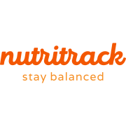
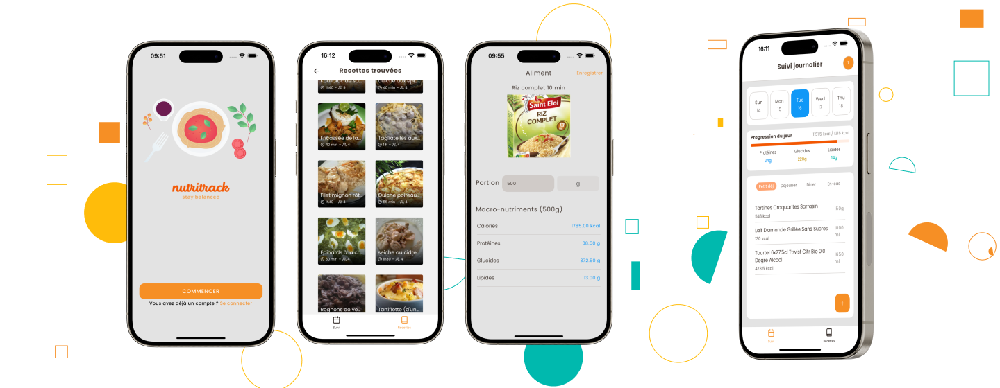

<h1 align="center">
	
</h1>

<h3 align="center">
  NutriTrack
</h3>

<p align="center"> Stay balanced</p>

<p align="center">
  
  
</p>

<p align="center">
  <a href="#-about-the-project">About the project</a>&nbsp;&nbsp;&nbsp;|&nbsp;&nbsp;&nbsp;
  <a href="#-technologies">Technologies</a>&nbsp;&nbsp;&nbsp;|&nbsp;&nbsp;&nbsp;
  <a href="#-getting-started">Getting started</a>&nbsp;&nbsp;&nbsp;|&nbsp;&nbsp;&nbsp;
</p>

<h1 align="center">
	
</h1>

## 👨🏻‍💻 About the project

<p>
NutriTrack is a React Native app designed to help users manage their nutrition and discover recipes. The app features two main components:

Daily Calorie Tracker: Users can track their daily calorie and macronutrient intake using personalized metrics like TDEE and BMR. Meals can be added manually or by scanning product barcodes using the Open Food Facts API, supported by a progress bar for real-time tracking.

Recipe Finder: This tool allows users to search for recipes based on ingredients stored in an SQLite database. Each recipe includes detailed preparation steps and nutritional information.

Additional Features: NutriTrack uses Firebase Authentication for secure user login and offers a customized onboarding experience to gather initial user data, enhancing personalization and security.

Designed for both iOS and Android, NutriTrack aims to simplify nutritional tracking and make dietary management accessible and engaging.

</p>

## 🚀 Technologies

Technologies that I used to develop this app

- [React Native](https://reactnative.dev/)
- [TypeScript](https://www.typescriptlang.org/)
- [RN Firebase](https://rnfirebase.io/)
- [SQLite (RN binding)](https://github.com/andpor/react-native-sqlite-storage)

## 💻 Getting started

### Requirements

- Setup your [react native environment](https://reactnative.dev/docs/set-up-your-environment)

**Clone the project and access the folder**

```bash
$ git clone https://github.com/imadKimouche/leftoverFit.git && cd leftoverFit
```

**Follow the steps below**

```bash
# Install the dependencies
$ npm i

# for iOS
$ cd ios && pod install
$ npm start
$ press `i`

# for Android
$ npm start
$ press `a`

```
